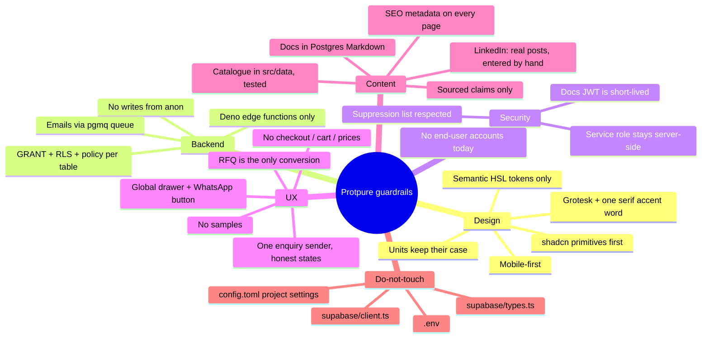

# AI conventions

Rules for any agent (human or AI) editing this codebase. These are not suggestions — they preserve the app's design integrity, security posture, and conversion path.

## Core architectural rules

- **Client-only React app.** No Node/Python/Ruby servers in the repo. All backend logic lives in `supabase/functions/*` (Deno) or the database.
- **RFQ is the only conversion path.** Every product / CTA / service / document flow funnels into `RFQContext` → `lib/enquiry.ts` → `send-transactional-email`. Do not add a checkout, cart, prices, or per-user account without explicit user request.
- **One sender.** `submitEnquiry` in `src/lib/enquiry.ts` is the only code that calls `send-transactional-email`. A form may show a confirmation only after it returns `{ ok: true }`; on failure it must offer the email / WhatsApp fallback.
- **No samples.** The site never offers samples, free or otherwise (client instruction). `src/test/catalog.test.ts` fails if such wording appears.
- **Sourced content only.** Every number and claim must be traceable to a client document listed in `docs/CONTENT_SOURCES.md`. If the documents disagree, follow the product list and record the conflict there. Never invent placeholder data, posts, downloads or file sizes.
- **Sourced pictures only.** A picture is the client's own (listed in `docs/CONTENT_SOURCES.md`) or a drawing made for the site and captioned "Illustration". No stock photographs, no generated product pictures, no retouching beyond crop, resize and compression. A pack image is shown only for the product line named on its label.
- **No end-user auth.** Adding sign-up/login requires an explicit user decision; it isn't free — it changes RLS, edge-function gating, and content strategy.
- **Never edit** `src/integrations/supabase/client.ts`, `src/integrations/supabase/types.ts`, `.env`, or `supabase/config.toml` project-level settings. They are auto-generated.

## UI / design conventions

- **Semantic HSL tokens only.** Colors live in `src/index.css` and are consumed via Tailwind theme + shadcn variants. No `text-white`, `bg-black`, or `bg-[#...]` in components.
- **Typography**: Schibsted Grotesk for headings and body, one Old Standard TT Italic accent word per headline (`.em`), IBM Plex Mono for labels. See `docs/DESIGN_SYSTEM.md`. Do not introduce Inter/Poppins/generic AI-default stacks.
- **Units keep their case.** `.label` uppercases text: never use it for `mL`, `µm`, `cm/h`, element symbols or catalogue numbers. Use `.code`.
- **Family colours always carry a text label**, and coral (`signal`) is never used as a text colour for small type or behind white text.
- **shadcn/ui first.** Prefer extending existing primitives over hand-rolled components.
- **Mobile-first responsive.** Use Tailwind breakpoints; every page must be usable at 360px width.
- **Preserve dark-mode compatibility** in every color choice.
- **Pack images and drawings stand on `plate`** (white on every surface), through `ProductFigure` / `ProductThumb`. Photographs go through `Photo`.

## Backend rules

- Every `CREATE TABLE public.*` migration must include, in order: `CREATE TABLE` → `GRANT` → `ALTER TABLE ... ENABLE ROW LEVEL SECURITY` → `CREATE POLICY`.
- If user roles are ever added, store them in a separate `user_roles` table with a `security definer` `has_role()` function. Never on a `profiles` table.
- Prefer validation triggers over `CHECK` constraints for time-dependent rules.
- Edge functions use `SUPABASE_SERVICE_ROLE_KEY` server-side only. Never return it, log it, or reference it in client code.
- Enqueue emails via `enqueue_email` RPC — do not bypass the queue for direct Resend calls (breaks retry/suppression).

## Component rules

- Keep files small and focused; one component per file where practical.
- UI-only changes stay in presentation code. Do not refactor business logic (RFQ, email, docs auth) unless the user explicitly asks.
- Use TanStack Query for all remote reads; contexts only for cross-page ephemeral state.
- Global overlays (`RFQDrawer`, `CompareTray`, `WhatsAppButton`) are mounted once in `components/site/SiteLayout.tsx` — do not remount inside pages.
- Catalogue content lives in `src/data/*`. Pages read it; they do not hard-code product facts. After editing data, run `npm test`.
- Charts follow the rules in `docs/DESIGN_SYSTEM.md` (one series, direct labels, data-table twin).

## Anti-patterns (never do)

- Hardcoded Tailwind colors or inline hex values.
- Storing roles or trust flags in client storage.
- Adding a backend framework (Express, Next API routes, FastAPI) to the repo.
- Editing Supabase auto-generated files.
- Sending email directly from the browser or an edge function without going through the queue.
- Referencing the Supabase dashboard, project IDs, or `supabase.com` URLs in user-facing UI or docs.
- Widening RLS on `docs` / email tables to `anon` or `authenticated`.
- Introducing `noscript` `` tracking pixels inside `<head>`.

## Decision records

| # | Decision | Rationale |
| --- | --- | --- |
| 1 | Password-gated docs hub instead of full user auth | Small partner audience; a shared password + short-lived JWT is enough and avoids account management |
| 2 | pgmq + pg_cron for transactional email | Keeps everything inside Lovable Cloud, retries survive worker restarts, no external queue vendor |
| 3 | LinkedIn posts are real posts, entered by hand | The earlier "curated fallback" was invented placeholder news and was removed. A live feed is not possible: the Lovable LinkedIn connection covers a personal profile, and LinkedIn gives a company page's posts only to developer apps it has approved. Posts the company published are copied into `src/data/linkedin-posts.ts`; with none listed the Contact page hides the block. The site no longer calls `linkedin-company-feed` (2026-10) |
| 4 | RFQ email idempotency via `idempotency_key` | Prevents double-sends from React StrictMode + retries |
| 5 | Catalogue is typed data in `src/data`, not Postgres | The `products` table was never read by the live site and held the 2025 range. 19 product lines change a few times a year; typed modules with tests are cheaper to keep correct than an unmaintained admin path. The table is left in place, unused (2026-10) |
| 6 | No dark mode toggle exposed | Brand is a single warm-light theme; `.dark` shares the `theme-ink` token mapping used for dark sections |
| 7 | Client PDFs are offered "on request", not as downloads | The current PDFs disagree with each other on specifications. Publish a file only after the client has corrected it (`file` in `src/data/resources.ts`) |
| 8 | Hand-written SVG charts, no chart library in the public bundle | Four small charts; full control over labels, contrast and the table twin |
| 9 | Contact validation without a schema library | Six fields; the schema library added about 80 kB to the main bundle |

## Guardrail mindmap

