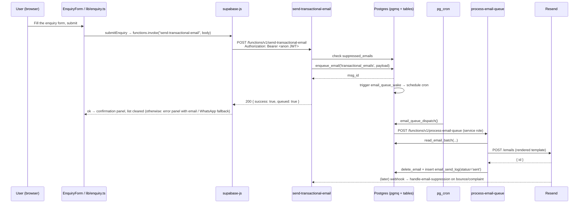

# API specification

All backend endpoints are Supabase Edge Functions (Deno). Invocation from the client uses `supabase.functions.invoke(name, { body })`, which POSTs JSON to `${SUPABASE_URL}/functions/v1/<name>` with the anon key attached. `verify_jwt` toggles come from `supabase/config.toml`.

## Edge function catalog

| Function | `verify_jwt` | Purpose |
| --- | --- | --- |
| `verify-doc-password` | false | Exchange the shared docs password for a short-lived JWT |
| `docs-content` | false | Return docs list or a single doc; requires the JWT above |
| `send-transactional-email` | true | Enqueue a template send (RFQ, contact, etc.) |
| `process-email-queue` | true | Cron/worker; drains pgmq → Resend |
| `preview-transactional-email` | false | Render a template to HTML for preview |
| `handle-email-unsubscribe` | false | Redeem an unsubscribe token → add to suppression list |
| `handle-email-suppression` | false | Resend webhook: record bounces/complaints |
| `linkedin-company-feed` | false | Not called by the site since 2026-10; to be deleted in Lovable (see below) |

### `verify-doc-password`

- **Method**: `POST`
- **Body**: `{ password: string }`
- **Response** (200): `{ token: string, expires_at: number /* epoch seconds */ }`
- **Errors**: 401 `{ error: "invalid_password" }`
- **Auth**: none (open) — compares body against the `DOCS_PASSWORD` secret and issues a signed short-lived JWT.

### `docs-content`

- **Method**: `POST`
- **Body**: `{ token: string, slug?: string }`
- **Response**:
  - Without `slug`: `{ docs: DocMeta[] }`
  - With `slug`: `{ doc: DocFull }`
- **Errors**: `{ error: "unauthorized" | "not_found" }`
- **Auth**: validates the token issued by `verify-doc-password`; reads `public.docs` with the service role.

### `send-transactional-email`

- **Method**: `POST` (JWT required — anon session key from the browser is sufficient)
- **Body**: `{ templateName: string, templateData?: object, idempotencyKey?: string, replyTo?: string, recipientEmail?: string }`
  (snake_case aliases are accepted). `recipientEmail` is ignored when the template defines a fixed recipient,
  which both current templates do (`sales@protpure.com`).
- **Response** (200): `{ success: true, queued: true }`, or `{ success: false, reason: "email_suppressed" }` when the recipient is on the suppression list.
- **Errors**: 403 for an origin outside the allowlist (`protpure.com`, `www.protpure.com`, `*.lovable.app`, `*.lovable.dev`), 429 above 5 requests per minute per IP, 400 for a missing template or an invalid `replyTo`, 404 for an unknown template, 500 on backend failures.
- **Flow**: origin + rate-limit check → suppression check → unsubscribe token → renders the React Email template → `enqueue_email('transactional_emails', ...)` → trigger `email_queue_wake` arms cron.
- **Templates**: `contact-submission`, `rfq-submission` (see `_shared/transactional-email-templates/registry.ts`).
- **Client**: called only from `submitEnquiry` in `src/lib/enquiry.ts`.

Template data sent by the site:

| Template | `templateData` |
| --- | --- |
| `rfq-submission` | `{ name, company, email, phone, country, requirements, items: [{ productName, packSize, catNo, quantity, notes }] }` — services and document requests are items too, with `productName` prefixed "Service: " or "Document request: " |
| `contact-submission` | `{ name, company, email, message }` — phone and country are appended to `message` |

### `process-email-queue`

- **Method**: `POST` (invoked by cron with the service role Bearer)
- **Body**: `{}`
- **Flow**: `read_email_batch` → send via Resend → on success `delete_email` + log `sent`; on retryable failure leave for retry; on hard failure `move_to_dlq` + log `failed`. Honours `email_send_state.retry_after_until` for global cooldowns.

### `preview-transactional-email`

- **Method**: `GET` / `POST`
- **Query/Body**: `{ template: string, data?: object }`
- **Response**: `text/html` — rendered template. Used for QA only.

### `handle-email-unsubscribe`

- **Method**: `GET`
- **Query**: `?token=...&email=...`
- **Flow**: Look up in `email_unsubscribe_tokens`, mark `used_at`, insert into `suppressed_emails` with reason `unsubscribe`. Redirects to `/unsubscribe`.

### `handle-email-suppression`

- **Method**: `POST` (Resend webhook — signature verified inside the function)
- **Body**: Resend event payload (`email.bounced`, `email.complained`, ...)
- **Flow**: Insert into `suppressed_emails` with the appropriate reason and metadata.

### `linkedin-company-feed`

- **Method**: `POST` (open)
- **Response**: `{ source: "live" | "fallback", posts: Post[] }` with `Post = { id, url, text, publishedAt, thumbnailUrl? }`
- **Flow**: Attempts the LinkedIn API through the Lovable connector gateway (`LOVABLE_API_KEY`, `LINKEDIN_API_KEY`). If that fails it returns `source: "fallback"` with an **empty** list. 30-minute in-memory cache.
- **Status**: it always returns the empty list. The Lovable LinkedIn connection covers a personal profile and cannot read a company page's posts. The site stopped calling it in 2026-10: `LinkedInFeed` now shows the posts listed in `src/data/linkedin-posts.ts`. The function is still deployed and should be deleted through Lovable, which also removes its entry in `supabase/config.toml`.

## External integrations

| Integration | Consumer | Notes |
| --- | --- | --- |
| Resend | `process-email-queue`, `handle-email-suppression` | Deliverable transport + webhook events |
| LinkedIn API | `linkedin-company-feed` (unused) | The connector cannot read company posts; the site shows hand-entered posts instead |
| Lovable AI Gateway | reserved (`LOVABLE_API_KEY` present) | Not currently invoked in production |

## Authenticated request flow (RFQ submission)

