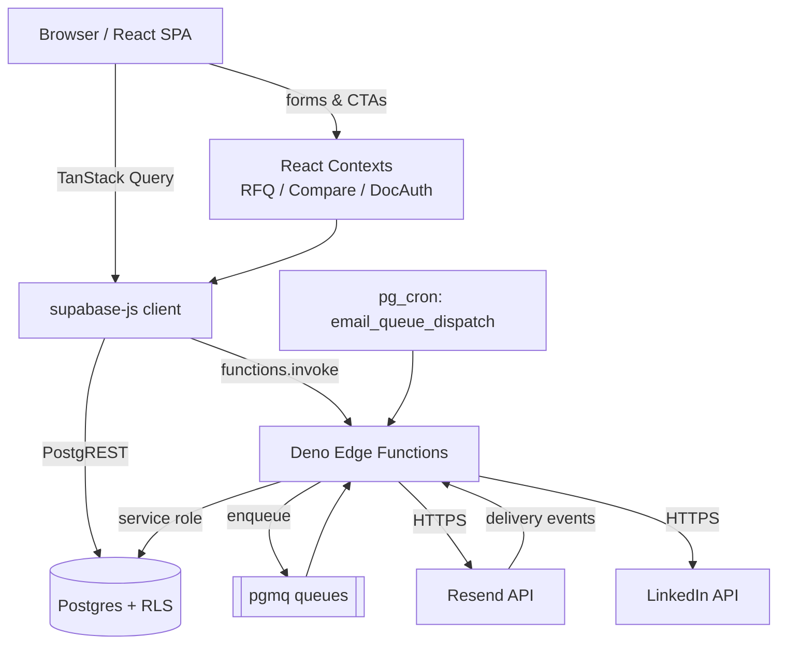

# Architecture

## Goals

- Present Protpure's resin catalog and technical differentiation to procurement and R&D audiences.
- Route every "buy / evaluate / sample" intent into a single RFQ pipeline delivered to the sales inbox.
- Provide a lightweight, password-gated Documents Hub for internal and partner-facing collateral.
- Keep the app fully client-rendered with a thin backend of Postgres + edge functions — no long-running servers.

## Non-goals

- No end-user accounts, dashboards, or per-user personalization.
- No e-commerce / cart-checkout; RFQ is the only conversion.
- No self-serve CMS; content is code + database seeds.

## Tech stack and rationale

| Layer | Choice | Why |
| --- | --- | --- |
| UI framework | React 18 + Vite 5 + TypeScript | Fast HMR, small runtime, first-class Lovable support |
| Styling | Tailwind CSS v3 + shadcn/ui | Design-token driven, dark-mode ready, no CSS drift |
| Data fetching | TanStack Query | Cache + retry for edge-function reads (products, docs, LinkedIn) |
| Local state | React Context (RFQ, Compare, DocAuth) | Small, colocated stores; no Redux overhead |
| Routing | React Router v6 | Nested guards for the docs hub |
| Backend | Lovable Cloud (Postgres + Deno edge functions + pgmq + cron) | Managed, RLS-enforced, no ops burden |
| Email | React Email templates + Resend (via edge function) | Type-safe templates, deliverable transport |
| Markdown | react-markdown + remark-gfm + rehype-slug + mermaid | Docs hub renders Markdown with diagrams |

## Environment variables (client)

Defined in `.env`. Auto-generated by Lovable Cloud — do not edit manually.

| Variable | Purpose |
| --- | --- |
| `VITE_SUPABASE_URL` | Backend base URL |
| `VITE_SUPABASE_PUBLISHABLE_KEY` | Anon key for the JS client |
| `VITE_SUPABASE_PROJECT_ID` | Project identifier |

## Server-side secrets (edge functions)

Stored in Lovable Cloud secret store; never shipped to the browser.

| Secret | Consumer |
| --- | --- |
| `SUPABASE_URL` / `SUPABASE_ANON_KEY` / `SUPABASE_SERVICE_ROLE_KEY` | All edge functions |
| `DOCS_PASSWORD` | `verify-doc-password` |
| `LINKEDIN_API_KEY` | `linkedin-company-feed` (managed by Lovable connector) |
| `LOVABLE_API_KEY` | Reserved for AI Gateway calls |
| `email_queue_service_role_key` (vault) | Cron → `process-email-queue` |

## Directory tree

```
.
├── docs/                       (this handover pack)
├── public/                     Static assets, robots.txt, sitemap.xml
├── src/
│   ├── App.tsx                 Routes + provider stack
│   ├── main.tsx                Entry
│   ├── index.css               Design tokens (HSL)
│   ├── components/
│   │   ├── layout/             Header, Footer, PageHero, WhatsAppFAB
│   │   ├── home/               Hero, USPGrid, CategoryGrid, ResinSelector, ...
│   │   ├── products/           Card, FilterSidebar, CompareBar, CompareModal,
│   │   │                       ProductDetailModal, FindYourResinPanel, BeadSizeSelector
│   │   ├── rfq/                RFQDrawer
│   │   ├── docs/               PasswordGate, MarkdownRenderer
│   │   └── ui/                 shadcn primitives
│   ├── context/                RFQContext, CompareContext, DocAuthContext
│   ├── hooks/                  useProducts, useDocs, use-toast, use-mobile
│   ├── integrations/supabase/  client.ts, types.ts (auto-generated)
│   ├── pages/                  Index, Products, Applications, About, Technology,
│   │                           Contact, Resources, Unsubscribe, NotFound,
│   │                           docs/DocumentsHub, docs/DocPage
│   ├── data/products.ts        Local product seed / fallback
│   ├── types/product.ts
│   └── lib/                    utils, persisted-state
├── supabase/
│   ├── config.toml             verify_jwt per function
│   └── functions/
│       ├── _shared/transactional-email-templates/  (React Email)
│       ├── verify-doc-password/
│       ├── docs-content/
│       ├── send-transactional-email/
│       ├── process-email-queue/
│       ├── preview-transactional-email/
│       ├── handle-email-unsubscribe/
│       ├── handle-email-suppression/
│       └── linkedin-company-feed/
├── index.html                  SEO metadata
├── tailwind.config.ts
├── vite.config.ts
└── package.json
```

## Data flow

