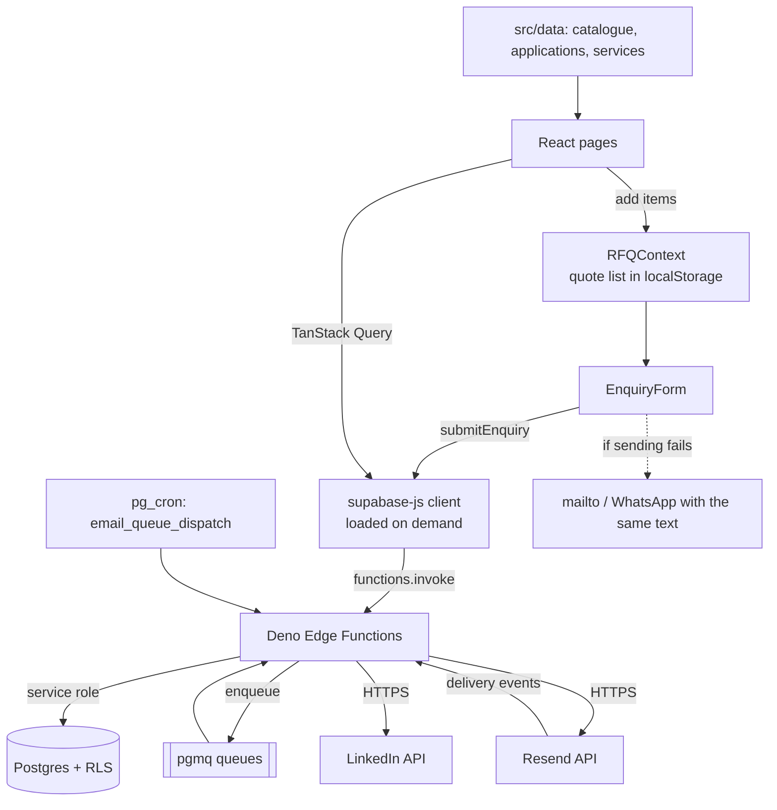

# Architecture

## Goals

- Present Protpure's full resin portfolio and its measured performance to process scientists and procurement teams.
- Route every "buy / evaluate / ask" intent into a single enquiry pipeline delivered to the sales inbox.
- Publish only what the client's documents support (see CONTENT_SOURCES.md).
- Provide a lightweight, password-gated Documents Hub for internal and partner-facing collateral.
- Keep the app fully client-rendered with a thin backend of Postgres + edge functions — no long-running servers.

## Non-goals

- No end-user accounts, dashboards, or per-user personalization.
- No e-commerce / cart-checkout and no prices; the quote request is the only conversion.
- No sample offers anywhere on the site (client instruction, enforced by a test).
- No self-serve CMS; content is typed data in `src/data`.

## Tech stack and rationale

| Layer | Choice | Why |
| --- | --- | --- |
| UI framework | React 18 + Vite 5 + TypeScript | Fast HMR, small runtime, first-class Lovable support |
| Styling | Tailwind CSS v3 + shadcn/ui | Design-token driven, no CSS drift |
| Catalogue data | Typed modules in `src/data` | 19 product lines change a few times a year; code review plus tests beat an admin screen nobody maintains |
| Remote reads | TanStack Query | Cache + retry for edge-function reads (docs hub, LinkedIn feed); loaded only on the pages that use it |
| Local state | React Context (RFQ, Compare, DocAuth) | Small, colocated stores; no Redux overhead |
| Routing | React Router v6, lazy routes | One chunk per page; the home page is in the main bundle |
| Charts | Hand-written SVG (`components/viz`) | Four small charts; no chart library to ship or theme |
| Backend | Lovable Cloud (Postgres + Deno edge functions + pgmq + cron) | Managed, RLS-enforced, no ops burden |
| Email | React Email templates + Resend (via edge function) | Type-safe templates, deliverable transport |
| Markdown | react-markdown + remark-gfm + rehype-slug + mermaid | Docs hub renders Markdown with diagrams |
| Tests | Vitest + Testing Library | Catalogue integrity, enquiry logic, a smoke test per route |

## Environment variables (client)

Defined in `.env`. The first three are auto-generated by Lovable Cloud — do not edit manually.

| Variable | Purpose |
| --- | --- |
| `VITE_SUPABASE_URL` | Backend base URL |
| `VITE_SUPABASE_PUBLISHABLE_KEY` | Anon key for the JS client |
| `VITE_SUPABASE_PROJECT_ID` | Project identifier |
| `VITE_ENQUIRY_DEMO` | Optional. `true` makes forms confirm without sending and skips the LinkedIn request |
| `VITE_PREVIEW` | Set by `npm run build:preview`, which writes the whole site as one offline HTML file (see `scripts/build-preview.mjs`, `src/lib/env.ts`) |

## Server-side secrets (edge functions)

Stored in Lovable Cloud secret store; never shipped to the browser.

| Secret | Consumer |
| --- | --- |
| `SUPABASE_URL` / `SUPABASE_ANON_KEY` / `SUPABASE_SERVICE_ROLE_KEY` | All edge functions |
| `DOCS_PASSWORD` | `verify-doc-password` |
| `LINKEDIN_API_KEY` | `linkedin-company-feed` (managed by Lovable connector) |
| `LOVABLE_API_KEY` | `linkedin-company-feed` connector gateway |
| `email_queue_service_role_key` (vault) | Cron → `process-email-queue` |

## Directory tree

```
.
├── docs/                       (this handover pack)
├── public/                     favicon set, og-image.png, robots.txt  (sitemap.xml is generated at build)
├── scripts/build-preview.mjs   Single-file offline preview (npm run build:preview)
├── src/
│   ├── App.tsx                 Routes + provider stack
│   ├── main.tsx                Entry
│   ├── index.css               Design tokens (HSL), fonts, base and component classes
│   ├── assets/                 fonts/ (self-hosted, OFL) and img/ (client photographs, WebP)
│   ├── components/
│   │   ├── brand/              Logo, Dots
│   │   ├── site/               SiteLayout, Header, Footer, PageHeader, Section, CTASection,
│   │   │                       Photo, Reveal, SearchDialog, LinkedInFeed, AnchorLink, ...
│   │   ├── catalog/            ProductLineCard, SpecTable, PackTable, EmptyColumnsTable, Badges,
│   │   │                       ResinFinder, ResinChip, AddToQuote, CompareTray
│   │   ├── rfq/                RFQDrawer, QuoteList, EnquiryForm
│   │   ├── viz/                ColumnHero, Halftone, GradeScale, Charts, Evidence, StatTile
│   │   ├── docs/               PasswordGate, MarkdownRenderer
│   │   └── ui/                 shadcn primitives
│   ├── context/                RFQContext, CompareContext, DocAuthContext
│   ├── data/                   catalog, packs, hardware, families, applications, services,
│   │                           evidence, company, resources, photos, site, nav
│   ├── hooks/                  useDocs, use-toast, use-mobile
│   ├── integrations/supabase/  client.ts, types.ts (auto-generated)
│   ├── lib/                    enquiry, seo, sci, catalog-helpers, catalog-export, download,
│   │                           persisted-state, query-client, use-focus-return, family-style, utils
│   ├── pages/                  Home, Products, ProductDetail, Applications, ApplicationDetail,
│   │                           Services, Technology, About, Resources, Contact, Quote,
│   │                           Unsubscribe, NotFound, docs/DocsLayout, docs/DocumentsHub, docs/DocPage
│   ├── test/                   catalog, enquiry, helpers, rfq-context, pages (vitest)
│   └── types/catalog.ts
├── supabase/
│   ├── config.toml             verify_jwt per function
│   └── functions/
│       ├── _shared/transactional-email-templates/  (React Email)
│       ├── verify-doc-password/
│       ├── docs-content/
│       ├── send-transactional-email/
│       ├── process-email-queue/
│       ├── preview-transactional-email/
│       ├── handle-email-unsubscribe/
│       ├── handle-email-suppression/
│       └── linkedin-company-feed/
├── index.html                  Default SEO metadata (each route sets its own via lib/seo.ts)
├── tailwind.config.ts
├── vite.config.ts              Also emits sitemap.xml from src/data at build time
└── package.json
```

## Data flow



## Bundle

The main bundle holds React, the router, the site frame, the home page and the catalogue data (about 135 kB gzipped). Each other page, the search dialog, the Supabase client, TanStack Query and the documents hub (Markdown, Mermaid) load only when used.
