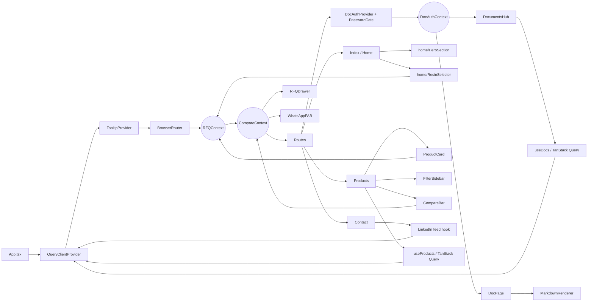

# Component tree

## Routes

Declared in `src/App.tsx`.

| Path | Element | Guard |
| --- | --- | --- |
| `/` | `Index` (home) | — |
| `/products` | `Products` | — |
| `/applications` | `Applications` | — |
| `/about` | `About` | — |
| `/technology` | `Technology` | — |
| `/procurement` | Redirect → `/about` | — |
| `/contact` | `Contact` (LinkedIn feed) | — |
| `/resources` | `Resources` | — |
| `/unsubscribe` | `Unsubscribe` | — |
| `/documents` | `DocumentsHub` | `DocAuthProvider` + `PasswordGate` |
| `/documents/:slug` | `DocPage` | `DocAuthProvider` + `PasswordGate` |
| `*` | `NotFound` | — |

## Provider stack

```
QueryClientProvider
└── TooltipProvider
    ├── Toaster (shadcn)
    ├── Sonner (toasts)
    └── BrowserRouter
        └── RFQProvider
            └── CompareProvider
                ├── <Routes />
                ├── RFQDrawer         (global slide-out)
                └── WhatsAppFAB       (global FAB)
```

`DocAuthProvider` is scoped only to `/documents/*` routes so its session token cannot leak into unrelated pages.

## Global state

| Store | Scope | Contents |
| --- | --- | --- |
| `QueryClient` (TanStack Query) | app-wide | Cached reads: products, docs list, single doc, LinkedIn feed |
| `RFQContext` | app-wide | Inquiry list, drawer open state, submit + idempotency |
| `CompareContext` | app-wide | Selected product IDs for the compare bar/modal |
| `DocAuthContext` | `/documents/*` only | JWT + expiry in `sessionStorage` |
| `persisted-state` hook | opt-in per feature | LocalStorage-backed useState |

## Layout components

- `layout/Header` — navigation, RFQ count badge, mobile menu
- `layout/Footer` — sitemap, legal, contact
- `layout/PageHero` — reusable page header with breadcrumb + title
- `layout/WhatsAppFAB` — floating WhatsApp CTA (always mounted)
- `rfq/RFQDrawer` — global inquiry drawer (always mounted)

## Feature groupings

- `home/` — HeroSection, USPGrid, TrustStrip, CategoryGrid, FlowVelocitySection, WhyProtpure, ResinSelector, FacilitySnapshot, CTABand
- `products/` — ProductCard, FilterSidebar, CompareBar, CompareModal, ProductDetailModal, FindYourResinPanel, BeadSizeSelector
- `docs/` — PasswordGate, MarkdownRenderer (with Mermaid support)
- `ui/` — shadcn primitives (button, dialog, sheet, form, etc.)

## Hierarchy and state consumption

