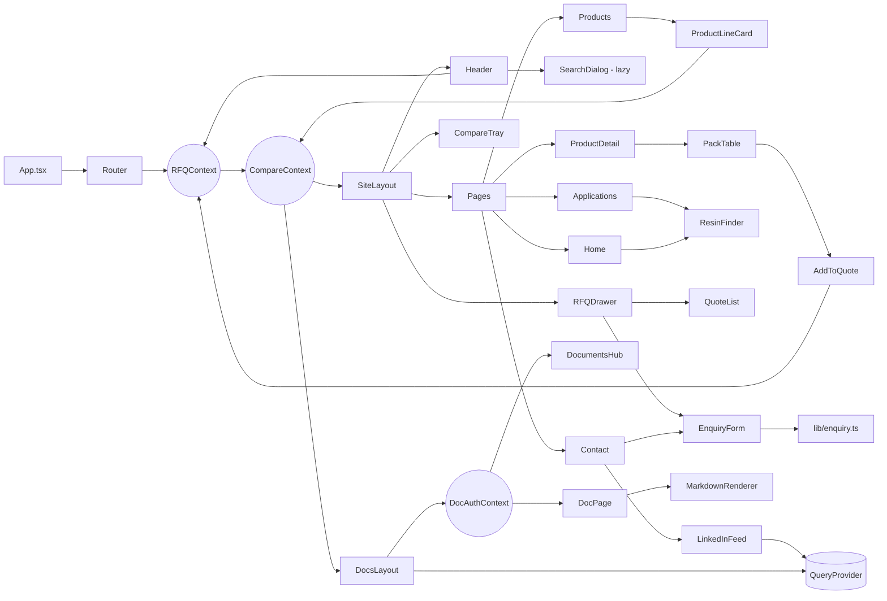

# Component tree

## Routes

Declared in `src/App.tsx`. Every page except the home page is loaded lazily.

| Path | Element | Notes |
| --- | --- | --- |
| `/` | `Home` | In the main bundle |
| `/products` | `Products` | Filters live in the URL: `?family=&grade=&stage=&q=&view=codes`. Old `?type=` links are translated |
| `/products/:slug` | `ProductDetail` | `?grade=` or `?variant=` highlights a grade; unknown slug renders `NotFound` |
| `/applications` | `Applications` | Resin finder at `#finder` |
| `/applications/:slug` | `ApplicationDetail` | One section per workflow, anchored by its slug |
| `/services` | `Services` | One section per service, anchored by its slug |
| `/technology` | `Technology` | `#platform`, `#techniques`, `#grades`, `#data`, `#sec` |
| `/about` | `About` | Company page (path kept from the previous site) |
| `/resources` | `Resources` | Documents on request, catalogue CSV, glossary |
| `/contact` | `Contact` | `?about=` pre-fills the message; live LinkedIn posts when available |
| `/quote` | `Quote` | The quote list as a full page (`noindex`) |
| `/unsubscribe` | `Unsubscribe` | Email preference link target (`noindex`) |
| `/procurement`, `/company` | Redirect → `/about` | Addresses from the previous site |
| `/documents`, `/documents/:slug` | `DocumentsHub`, `DocPage` | Inside `DocsLayout`: `QueryProvider` + `DocAuthProvider` + `PasswordGate`; no site header |
| `*` | `NotFound` | |

## Provider stack

```
Toaster (sonner)
BrowserRouter            (MemoryRouter in the preview build)
└── RFQProvider
    └── CompareProvider
        └── <Routes>
            ├── SiteLayout                 all public pages
            │   ├── skip link
            │   ├── Header                 utility bar, navigation, flyouts, search, quote button, mobile menu
            │   ├── <main id="main"> <Outlet /> </main>
            │   ├── Footer
            │   ├── RFQDrawer              global quote panel
            │   ├── CompareTray            bar + dialog, shown on /products…
            │   ├── WhatsAppButton
            │   └── ScrollManager          scroll/focus on navigation, #hash targets
            └── DocsLayout                 /documents…
```

`QueryProvider` (TanStack Query) wraps only the two consumers of remote reads: `DocsLayout` and `LinkedInFeed`.
`DocAuthProvider` is scoped to `/documents/*` so its session token cannot leak into unrelated pages.

## Global state

| Store | Scope | Contents |
| --- | --- | --- |
| `RFQContext` | app-wide | Quote list (localStorage `protpure_quote_list_v2`), drawer open state, contact draft (memory only) |
| `CompareContext` | app-wide | Up to three product slugs (sessionStorage `protpure_compare_v2`), dialog state |
| `DocAuthContext` | `/documents/*` only | JWT + expiry in `sessionStorage` |
| `QueryClient` (`lib/query-client.tsx`) | docs hub, LinkedIn feed | Cached reads from edge functions |
| URL search params | `/products` | Filters, search text, view |

## The enquiry pipeline

```
ProductDetail / Products (codes) / Services / Resources / Technology
   └─ AddToQuote ──► RFQContext.addItem(kind: product | hardware | service | document)
RFQDrawer, /quote ──► QuoteList + EnquiryForm(items)
/contact ──────────► EnquiryForm(no items)
EnquiryForm ───────► lib/enquiry.ts  validateContact → submitEnquiry
                        items  → template "rfq-submission"
                        none   → template "contact-submission"
                     success → confirmation panel, list cleared
                     failure → error panel with mailto: and WhatsApp links carrying the same text
```

`submitEnquiry` is the only caller of `send-transactional-email`. It resolves with `{ ok: false }` instead of
throwing, and treats `{ success: false }` (suppressed recipient) as a failure.

## Feature groupings

- `site/` — SiteLayout, Header (flyouts, mobile menu), Footer, PageHeader + Breadcrumbs, Section (Eyebrow, SectionHeader, Em), CTASection, Photo, Reveal, SearchDialog, LinkedInFeed, AnchorLink, ScrollManager, WhatsAppButton
- `catalog/` — ProductLineCard, SpecTable, PackTable, EmptyColumnsTable, Badges (Family, Grade, Stage, New), ResinFinder + StageColumns, ResinChip, AddToQuote, CompareTray
- `rfq/` — RFQDrawer, QuoteList, EnquiryForm
- `viz/` — ColumnHero (animated hero), Halftone (family illustrations), GradeScale, Charts (LineChart, DataTable), Evidence (charts bound to `data/evidence.ts`), StatTile
- `brand/` — Logo, Dots
- `docs/` — PasswordGate, MarkdownRenderer (with Mermaid support)
- `ui/` — shadcn primitives (button, dialog, sheet, command, input, …)

## Hierarchy and state consumption



## Accessibility notes

- One `<h1>` per page; landmarks: `header`, `main`, `footer`, labelled `nav`s.
- Overlays opened from several places use `lib/use-focus-return.ts`, so focus returns to the opener
  (or to `<main>` after a link inside the overlay was followed) without moving the page.
- The header is sticky. Content inside `<main>` and `<footer>` carries a scroll margin (`index.css`), so
  `#section` links and keyboard focus stop below it. Do not use `scroll-padding` on `<html>` for this:
  it makes the header's own controls scroll the page when they receive focus.
- On wide screens the utility bar scrolls away; keyboard focus inside it brings it back.
- Same-page links use `AnchorLink` (works under both routers and respects reduced motion).
- Animations stop under `prefers-reduced-motion`; the hero shows a still frame.
