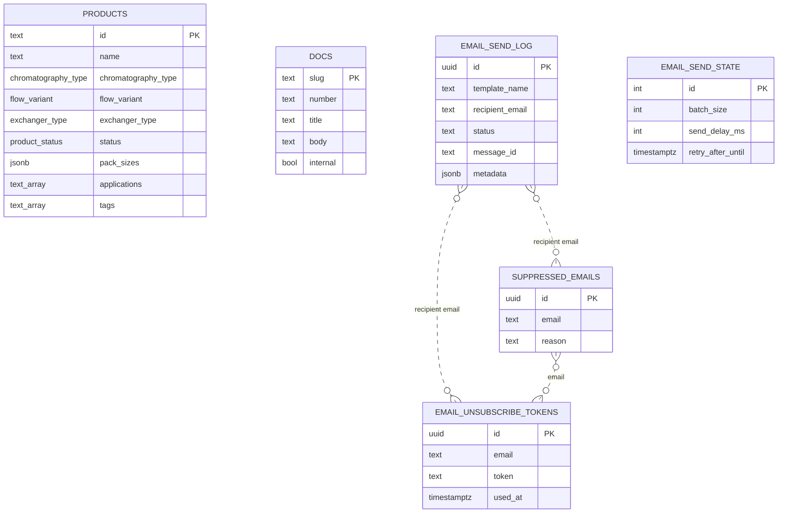

# Data model

## Catalogue data (in code)

Since the 2026 revamp the catalogue is typed data in `src/data`, described by `src/types/catalog.ts`.
The site does not read the `products` table below.

| Module | Shape | Notes |
| --- | --- | --- |
| `families.ts` | `Family[]`, `Grade[]`, `Stage[]` | 9 families (6 resin techniques, 3 formats), 3 grades, 3 stages |
| `catalog.ts` | `Product[]` | A product line has `variants` (grades or formats); each variant has `specs` and `packs` |
| `packs.ts` | `Record<variantId, Pack[]>` | 190 catalogue numbers; `Pack = { catNo, size }` |
| `hardware.ts` | `EmptyColumn[]` | 64 empty columns |
| `applications.ts` | `Application[]` → `SubApplication[]` → `stages` | Each stage lists `ResinRef`s that link to a product (and grade) or a family |
| `services.ts` | `Service[]` | SC001–SC004 |
| `evidence.ts` | constants | Measured data behind the charts |
| `resources.ts` | `Resource[]`, glossary | A resource with `file` downloads; without it, it is requested by enquiry |

Quote-list items (`RFQItem` in `src/lib/enquiry.ts`) are keyed by catalogue number and have a `kind`:
`product`, `hardware`, `service` or `document`.

Integrity is checked by `src/test/catalog.test.ts`: counts match the client's sheets, catalogue numbers are
unique, and every related product, featured product, document link and application recommendation resolves.

## Backend tables

All tables live in the `public` schema. Row-Level Security is enabled on every table; the anon Data API can only read `products`. Everything else is service-role only and touched exclusively by edge functions.

## Enums

| Enum | Values |
| --- | --- |
| `chromatography_type` | `iec`, `affinity`, `sec`, `hic`, `magnetic` |
| `exchanger_type` | `strong-cation`, `weak-cation`, `strong-anion`, `weak-anion` |
| `flow_variant` | `faster`, `standard`, `precise`, `hr` |
| `product_status` | `available`, `evaluation`, `pipeline` |

## Tables

### `products`

Legacy public catalog (2025 range). **Not read by the site since the 2026 revamp**; kept so nothing in the
backend has to change. Drop it, or re-seed it from `src/data`, if a database-backed catalogue is ever wanted.

| Column | Type | Notes |
| --- | --- | --- |
| `id` | text | PK, human-readable SKU |
| `name`, `subtitle` | text | Display |
| `chromatography_type` | `chromatography_type` | enum |
| `flow_variant` | `flow_variant` | default `standard` |
| `exchanger_type` | `exchanger_type` | nullable (IEC only) |
| `ligand`, `matrix` | text | |
| `dbc`, `dbc_unit` | text | Dynamic binding capacity spec |
| `flow_spec`, `max_flow_velocity` | text | |
| `particle_size_d50v`, `particle_size_range` | text | |
| `ionic_capacity` | text | nullable |
| `ph_operational`, `ph_cip`, `chemical_stability`, `storage` | text | |
| `applications`, `tags` | text[] | |
| `pack_sizes` | jsonb | Array of `{size, unit}` |
| `delivery_time` | text | |
| `status` | `product_status` | default `available` |
| `sort_order` | int | display order |
| `created_at`, `updated_at` | timestamptz | |

**RLS**

- `Products are publicly readable` — `SELECT` to `public` (anon+authenticated), `USING (true)`

### `docs`

Password-gated Markdown documents rendered by `MarkdownRenderer`.

| Column | Type | Notes |
| --- | --- | --- |
| `slug` | text | PK-like unique identifier used in URL |
| `number` | text | Doc numbering (e.g. `01`) |
| `title`, `summary` | text | |
| `body` | text | Markdown source |
| `read_time` | text | e.g. `5 min` |
| `diagram_count` | int | default 0 |
| `internal` | bool | default false |
| `sort_order` | int | default 0 |
| `created_at`, `updated_at` | timestamptz | |

**RLS** — enabled, no policies. Only reachable via the `docs-content` edge function using the service role after JWT verification.

### `email_send_log`

Append-only log of every transactional send attempt.

| Column | Type | Notes |
| --- | --- | --- |
| `id` | uuid | PK |
| `template_name` | text | e.g. `rfq-submission` |
| `recipient_email` | text | |
| `status` | text | `queued` / `sent` / `failed` / `suppressed` |
| `message_id` | text | Resend id |
| `error_message` | text | nullable |
| `metadata` | jsonb | Correlation payload |
| `created_at` | timestamptz | |

**RLS policies**

- `Service role can insert send log` — `INSERT` `WITH CHECK (auth.role() = 'service_role')`
- `Service role can read send log` — `SELECT` `USING (auth.role() = 'service_role')`
- `Service role can update send log` — `UPDATE` `USING/CHECK (auth.role() = 'service_role')`

### `email_send_state`

Singleton config row (`id=1`) for the email dispatcher.

| Column | Type | Notes |
| --- | --- | --- |
| `id` | int | PK, always 1 |
| `batch_size` | int | pgmq read batch |
| `send_delay_ms` | int | Inter-send throttle |
| `retry_after_until` | timestamptz | Global cooldown |
| `auth_email_ttl_minutes` | int | |
| `transactional_email_ttl_minutes` | int | |
| `updated_at` | timestamptz | |

**RLS** — `Service role can manage send state` (`ALL`)

### `email_unsubscribe_tokens`

One-time tokens embedded in outbound email footers.

| Column | Type | Notes |
| --- | --- | --- |
| `id` | uuid | PK |
| `email` | text | |
| `token` | text | random opaque token |
| `created_at` | timestamptz | |
| `used_at` | timestamptz | nullable, set on redeem |

**RLS** — service-role INSERT / SELECT / UPDATE.

### `suppressed_emails`

Hard-suppression list (unsubscribe, bounce, complaint).

| Column | Type | Notes |
| --- | --- | --- |
| `id` | uuid | PK |
| `email` | text | |
| `reason` | text | `unsubscribe` / `bounce` / `complaint` |
| `metadata` | jsonb | |
| `created_at` | timestamptz | |

**RLS** — service-role INSERT / SELECT.

## Database functions

| Function | Purpose |
| --- | --- |
| `enqueue_email(queue_name, payload)` | Push onto a pgmq queue (auto-creates queue) |
| `read_email_batch(queue_name, batch_size, vt)` | Batch pop with visibility timeout |
| `delete_email(queue_name, message_id)` | Ack |
| `move_to_dlq(source_queue, dlq_name, message_id, payload)` | Send failed messages to DLQ |
| `email_queue_dispatch()` | Cron entrypoint: calls the `process-email-queue` edge function |
| `email_queue_wake()` | Trigger-side: arms the cron on first enqueue |
| `update_updated_at_column()` | Reusable trigger to maintain `updated_at` |

## GRANTs (effective)

- `products` — `SELECT` granted to `anon` and `authenticated`; full CRUD to `service_role`.
- `docs`, `email_send_log`, `email_send_state`, `email_unsubscribe_tokens`, `suppressed_emails` — no grants to `anon`/`authenticated`; full access reserved to `service_role` used by edge functions.

## Entity relationships

There are no hard foreign keys between tables — `email` is a logical join key across the email domain, and `products` / `docs` are independent content stores.