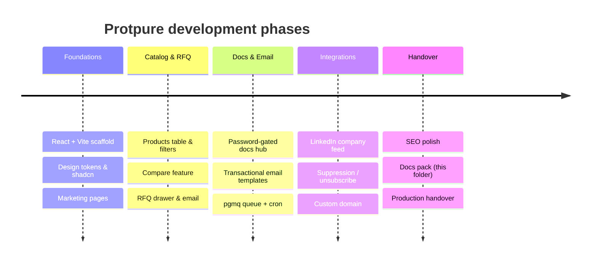

# Protpure — Master Documentation Index

Protpure is the marketing and lead-generation web application for **Protpure Technologies Pvt Ltd**, an Indian manufacturer of chromatography resins used in biopharma downstream purification. The site's business intent is to convert plant-scale procurement teams and process scientists into qualified inquiries: every product, comparison, resin-selector and documents-hub interaction funnels users into a single Request-for-Quote (RFQ) flow that emails the sales inbox. There are no end-user accounts; the app is client-side (React + Vite) backed by Lovable Cloud edge functions and Postgres for the product catalog, gated documents hub, transactional email queue, and a live LinkedIn company feed.

## Navigation

| Document | Purpose |
| --- | --- |
| [ARCHITECTURE.md](./ARCHITECTURE.md) | System goals, stack rationale, env vars, directory tree, data-flow diagram |
| [DATA_MODEL.md](./DATA_MODEL.md) | Tables, columns, enums, RLS policies, GRANTs, ER diagram |
| [API_SPEC.md](./API_SPEC.md) | Edge functions, payloads, auth, external integrations |
| [COMPONENT_TREE.md](./COMPONENT_TREE.md) | Routing, providers, layouts, global state |
| [SECURITY_AND_OPS.md](./SECURITY_AND_OPS.md) | Auth, RLS, secrets, queue ops, deploy, exports |
| [AI_CONVENTIONS.md](./AI_CONVENTIONS.md) | Guardrails, anti-patterns, decision records |

## Current SDLC phase

**Production / iterative enhancement.** The public site is live at `protpure.com` and `www.protpure.com`. Active focus areas:

- RFQ conversion polish (drawer UX, idempotency, email deliverability)
- LinkedIn company-feed integration (Contact page) with curated fallback
- Password-gated Documents Hub for internal/partner content
- Transactional email queue reliability (pgmq + cron dispatcher, suppression list)
- SEO metadata, sitemap, structured data

## Development timeline

Folder structure ready: `docs/` contains this index plus the six referenced files.