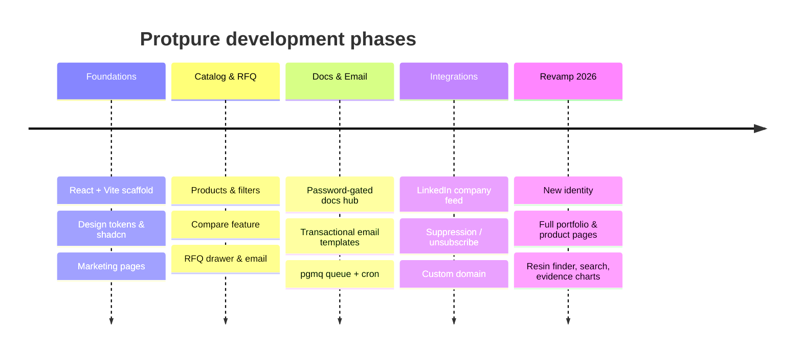

# Protpure — Master Documentation Index

Protpure is the marketing and lead-generation web application for **Protpure Tech Pvt. Ltd.**, an Indian manufacturer of agarose chromatography resins used in downstream purification. The site's business intent is to turn process scientists and procurement teams into qualified enquiries: every product page, the catalogue-number list, the resin finder, the services and the documents all feed one quote list, which is emailed to the sales inbox. There are no end-user accounts. The app is client-side (React + Vite). The catalogue is static, typed data in the repository; Lovable Cloud edge functions provide the transactional email queue, the LinkedIn company feed and the password-gated documents hub.

## Navigation

| Document | Purpose |
| --- | --- |
| [ARCHITECTURE.md](./ARCHITECTURE.md) | System goals, stack rationale, env vars, directory tree, data-flow diagram |
| [COMPONENT_TREE.md](./COMPONENT_TREE.md) | Routing, providers, layouts, global state |
| [DESIGN_SYSTEM.md](./DESIGN_SYSTEM.md) | Colour tokens, typography, layout patterns, chart rules |
| [CONTENT_SOURCES.md](./CONTENT_SOURCES.md) | Where each fact comes from; open questions for the client |
| [DATA_MODEL.md](./DATA_MODEL.md) | Catalogue data in code; backend tables, enums, RLS policies |
| [API_SPEC.md](./API_SPEC.md) | Edge functions, payloads, auth, external integrations |
| [SECURITY_AND_OPS.md](./SECURITY_AND_OPS.md) | Auth, RLS, secrets, queue ops, deploy, exports |
| [AI_CONVENTIONS.md](./AI_CONVENTIONS.md) | Guardrails, anti-patterns, decision records |

## Current SDLC phase

**Production / revamp 2026.** The public site is live at `protpure.com` and `www.protpure.com`. The October 2026 revamp (branch `revamp/2026`) rebuilt the front end:

- New visual identity around the existing logo (see DESIGN_SYSTEM.md)
- Full 2026 portfolio: 19 product lines, 190 catalogue numbers, 64 empty columns, 4 services
- A page per product and per application, a resin finder, site search, comparison
- One enquiry pipeline for quotes, services, documents and general questions, with honest success and failure states
- Measured performance data shown as charts with their test conditions

Unchanged: the backend (email queue, unsubscribe, documents hub, LinkedIn feed function), the routes of the previous site, and the logo.

Open before launch: the client confirmations listed in CONTENT_SOURCES.md, section 3.

## Development timeline

Folder structure: `docs/` contains this index plus the eight referenced files. The copies shown in the password-gated documents hub live in the `docs` database table and are updated separately.
