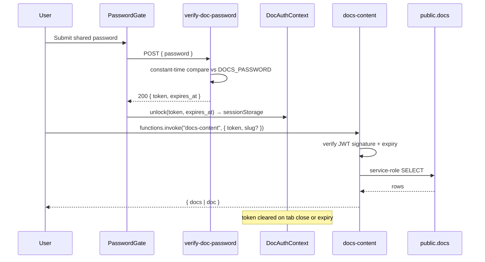

# Security and operations

## Authentication model

The public site has **no end-user accounts**. There are two auth surfaces:

1. **Docs Hub password gate** — `verify-doc-password` compares a submitted password against the `DOCS_PASSWORD` secret and returns a short-lived signed JWT. The token + `expires_at` are stored in `sessionStorage` under `protpure_docs_token(_exp)` and cleared on tab close or expiry. All doc reads go through `docs-content` which re-verifies the token server-side.
2. **Anonymous Data API** — `products` is publicly readable (`SELECT` policy `USING (true)`), but the site no longer reads it. No writes are exposed to the client.

There is no Supabase Auth user, no OAuth provider, no email/password flow — adding one is intentionally deferred until a real user account use case exists.

## Edge function security matrix

| Function | `verify_jwt` | Access rule |
| --- | --- | --- |
| `verify-doc-password` | false | Rate-limit friendly; only accepts password → token exchange |
| `docs-content` | false | Re-verifies its own JWT inside the function |
| `preview-transactional-email` | false | Renders templates only, no side effects |
| `handle-email-unsubscribe` | false | Idempotent token redemption |
| `handle-email-suppression` | false | Verifies Resend webhook signature inside |
| `linkedin-company-feed` | false | Read-only outbound fetch, cached. No longer called by the site (2026-10); delete it through Lovable |
| `send-transactional-email` | true | Requires the anon JWT, an allowed `Origin` (protpure.com, www.protpure.com, `*.lovable.app`, `*.lovable.dev`) and stays under 5 requests per minute per IP |
| `process-email-queue` | true | Called by cron with the service-role Bearer from vault |

## RLS enforcement

- Every public table has `ENABLE ROW LEVEL SECURITY`.
- Only `products` exposes `SELECT` to `anon`/`authenticated`.
- All email domain tables and `docs` are service-role only; edge functions read/write them using `SUPABASE_SERVICE_ROLE_KEY`, which never leaves the function runtime.

## Secret management

All secrets are stored in Lovable Cloud's secret store and injected into edge functions as env vars. None are shipped to the browser. The cron uses `email_queue_service_role_key` from `vault.decrypted_secrets` (never inlined in SQL).

**Never** hardcode `SUPABASE_SERVICE_ROLE_KEY` in client code, log it in edge functions, or echo it into responses. `LINKEDIN_API_KEY` is connector-managed; rotate via the Connectors UI rather than the secrets tool.

## Email queue operations

- Producer: `send-transactional-email` calls `enqueue_email` on `q_transactional_emails` (or `q_auth_emails`).
- Arm cron: enqueue trigger `email_queue_wake` schedules `process-email-queue` every 5 seconds if not already scheduled.
- Worker: cron → `email_queue_dispatch()` → HTTP `POST` to `process-email-queue` with the vault-stored service-role Bearer.
- Retry: transient failures leave the message for pgmq's visibility-timeout redelivery; hard failures go to a DLQ via `move_to_dlq`.
- Global cooldown: `email_send_state.retry_after_until` short-circuits dispatch after Resend rate-limit signals.
- Disarm: when both queues drain, dispatcher `cron.unschedule`s itself under an advisory lock to avoid racing new enqueues.

## Suppression and unsubscribe

- Every outbound email includes an unsubscribe link with a one-time token from `email_unsubscribe_tokens`.
- `handle-email-unsubscribe` marks the token `used_at` and inserts into `suppressed_emails` (reason `unsubscribe`).
- Resend delivery events (bounce, complaint) hit `handle-email-suppression` which also inserts into `suppressed_emails`.
- `send-transactional-email` checks `suppressed_emails` before enqueueing and short-circuits with a `suppressed` log entry.

## Hosting and deploy

- Hosted on Lovable Cloud.
- Preview URL: `id-preview--658f12e7-f8c2-4aa2-adb9-8ef223d9a517.lovable.app`.
- Published URL: `protpure.lovable.app`.
- Custom domains: `protpure.com`, `www.protpure.com`.
- Deploys are triggered from the Lovable IDE — no separate CI pipeline.

### Moving to another host

The app is a static bundle and can be served from any web server with a single-page-app fallback
(unknown paths serve `index.html`). Two things must follow the move:

- add the new origin to `ALLOWED_ORIGINS` in `supabase/functions/send-transactional-email/index.ts`, otherwise every enquiry is refused with 403 (the form then shows its email / WhatsApp fallback);
- keep `VITE_SUPABASE_*` set at build time.

## Client-side data

- The quote list is stored in `localStorage` (`protpure_quote_list_v2`): catalogue numbers, quantities, notes. It is validated when read.
- Contact details typed into an enquiry form are kept in memory only and are never written to storage.
- The comparison selection is stored in `sessionStorage` (`protpure_compare_v2`).
- The enquiry form has a honeypot field; a filled honeypot is accepted silently and nothing is sent.

## Data export

Full database exports are available via **Cloud → Advanced settings → Export data** in the Lovable product. Ad-hoc CSV exports for a specific query/table can be produced by the maintainer through the same panel. There is no self-serve import UI.

## Docs password auth flow

