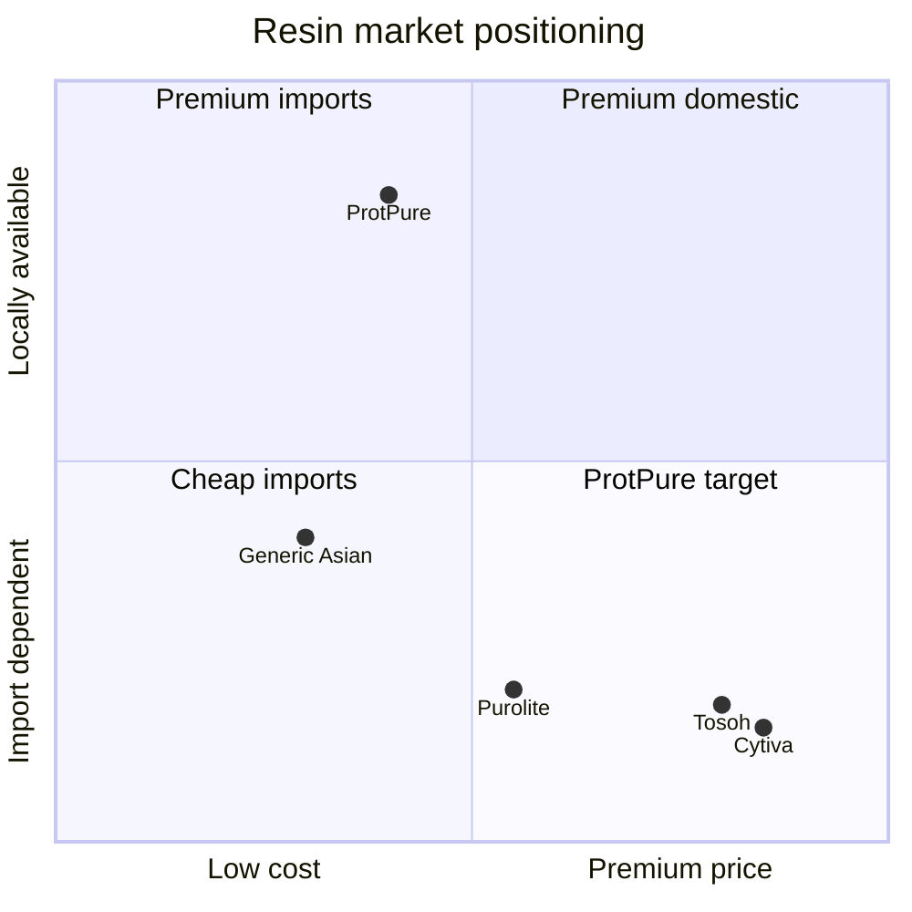

# Vision & Pitch

ProtPure is building India's first vertically integrated agarose chromatography resin manufacturer — closing a strategic supply gap for the global biopharmaceutical purification market.

## The problem

India runs one of the world's largest biopharma pipelines, yet imports more than **95% of the chromatography resins** that purify those molecules. Every batch of insulin, monoclonal antibody, or vaccine produced domestically is held hostage to overseas lead times, FX swings, and export controls. When a single resin lot slips, an entire downstream campaign slips with it.

## Mission

Deliver world-class downstream purification media — manufactured in India, validated to global standards, priced for the buyers who need them most.

## 60-second pitch

> ProtPure makes the agarose-based chromatography resins that biopharma manufacturers use to purify proteins. We replace imported Cytiva, Tosoh, and Purolite SKUs with locally produced equivalents at 30–50% lower landed cost, with 4–6 week lead times instead of 12–20. Our first product family is ion-exchange (Q, SP, DEAE, CM); affinity and SEC follow. We ship to mAb manufacturers, vaccine producers, CDMOs, and academic labs.

## Customer archetypes

| Archetype | Pain we solve | Decision criteria |
|---|---|---|
| **mAb manufacturer** | Long resin lead times block campaign starts | DBC, batch consistency, regulatory file |
| **Vaccine producer** | FX-driven cost volatility on imported media | Cost per gram protein purified |
| **CDMO** | Multi-client flexibility, fast custom requests | Catalog breadth + custom ligand service |
| **Academic lab** | Small pack sizes, fast quote turnaround | Price, availability, support |

## Why now

- India's biopharma exports crossed an inflection point in 2024–25.
- PLI schemes and Make-in-India incentives reward indigenous capability.
- Global resin supply has been visibly fragile post-2020.
- Agarose bead manufacturing know-how is now reproducible at pilot scale within India.

## Three-year north star

By the end of FY28: a credible second-source supplier for at least three of the top ten Indian biopharma manufacturers, with at least one validated export channel into Southeast Asia.

## Market positioning

## Founder note

ProtPure exists because India already does the hard part — making the molecule. We're closing the last expensive mile of the supply chain so that domestic biomanufacturing isn't permanently dependent on a handful of overseas vendors. Boring infrastructure, strategically placed.