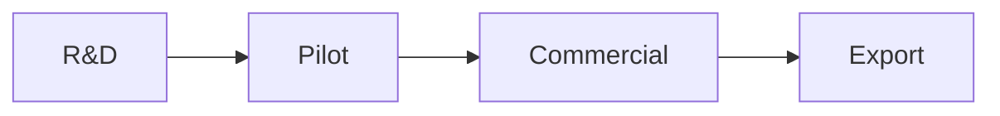

# Vision

ProtPure is building India's first vertically integrated agarose chromatography resin manufacturer, serving the global biopharmaceutical purification market.

## Mission

Deliver world-class downstream purification media — manufactured locally, validated globally.

## Why now

- India's biopharma sector is scaling rapidly
- Import dependence on resins exceeds 95%
- Domestic capability closes a strategic supply chain gap

## Product pillars

| Pillar | Description |
|--------|-------------|
| Ion Exchange | Strong/weak anion and cation exchangers |
| Affinity | Protein A, IMAC, custom ligands |
| Size Exclusion | Desalting and polishing grades |

## Roadmap

