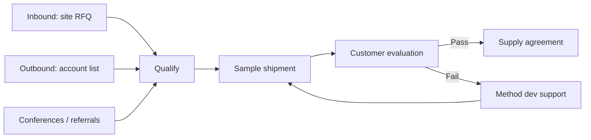

# Business & Scope

How ProtPure makes money, who it sells to, and what is explicitly *not* in the v1 plan.

## Revenue streams

1. **Catalog resin sales.** Standard SKUs in pack sizes from 50 mL to 100 L. Highest volume, predictable margin.
2. **Custom ligand development.** Bespoke chemistry projects against a customer's target molecule. Lower volume, higher margin, locks in catalog follow-on.
3. **Method development services.** Consulting on column packing, buffer screening, and process scale-up. Acts as a top-of-funnel for catalog adoption.

## Market sizing

| Layer | Definition | Indicative scale |
|---|---|---|
| TAM | Global agarose chromatography resin market | ~USD 2.4B |
| SAM | India + SEA biopharma resin demand | ~USD 180M |
| SOM (3-yr) | Realistic share given capacity & GTM | USD 8–12M ARR |

Numbers above are working estimates for internal planning; replace with current third-party figures before any external use.

## Target segments

- **mAb manufacturers** — anchor accounts; Q/SP for capture and polish.
- **Vaccine producers** — DEAE/CM for envelope protein purification.
- **CDMOs** — multi-product flexibility; value catalog breadth.
- **Academic & translational labs** — small packs; price-sensitive; future advocates.

## Pricing model

- **Volume tiers** with break points at 1 L, 10 L, and 100 L.
- **Custom-quote default.** Public site does not list prices; every serious lead routes through RFQ.
- **Annual supply agreements** for anchor accounts with rebates against committed volume.

## In scope for v1

- Ion-exchange family (Q, SP, DEAE, CM).
- Standard pack sizes via the public catalog.
- RFQ-driven sales motion (no public e-commerce).
- India-first GTM with one validated export account.

## Out of scope for v1

- Public pricing pages.
- Self-serve checkout / payments.
- Affinity ligands beyond Protein A pilot (catalog launch H2).
- Distributor reseller program (deferred to FY27).
- GMP-graded SKUs separate from research-grade (validated case-by-case until volume justifies a separate line).

## GTM motion

## Success metrics (FY26)

| Metric | Target |
|---|---|
| Active catalog SKUs | 12+ |
| Qualified RFQs / month | 25 |
| Sample-to-supply conversion | 30% |
| Repeat order rate | 50% |