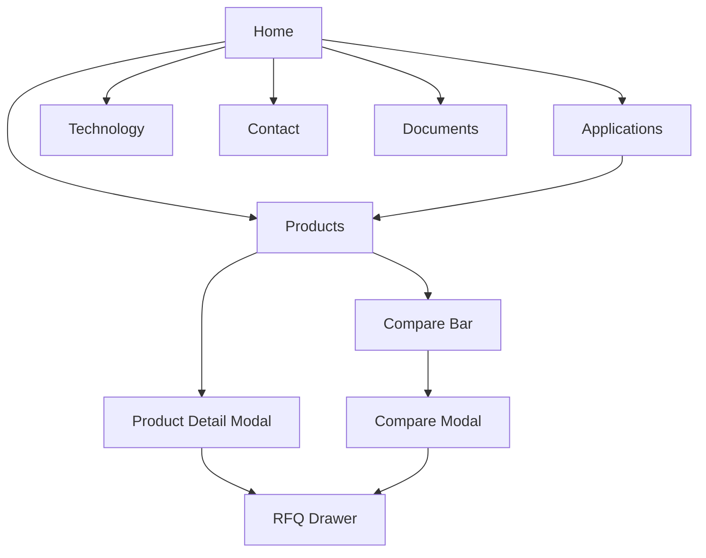

# Product & UX

How the protpure.com experience is structured and the journeys it optimizes for.

## Information architecture

| Route | Purpose |
|---|---|
| `/` | Home — positioning, category entry, social proof, CTA to RFQ |
| `/products` | Filterable catalog with comparison and detail modal |
| `/applications` | Use-case-led entry into the catalog (mAb, vaccines, etc.) |
| `/technology` | Bead architecture, ligand chemistry, QC story |
| `/about` | Company, facility, team, procurement contacts |
| `/resources` | Spec sheets, application notes, downloads |
| `/contact` | General contact + WhatsApp |
| `/documents` | Password-gated internal documentation hub |

## Primary user journeys

**Journey A — Browse → Compare → RFQ.** Buyer lands on `/products`, applies filters (chromatography type, exchanger, flow variant), opens 2–3 product cards into the Compare bar, opens the Compare modal, then sends the shortlist as an RFQ via the drawer.

**Journey B — Find Your Resin → PDP → RFQ.** Less expert visitor enters the Find-Your-Resin guided panel on the home or products page, gets a recommended product, opens the Product Detail Modal, and adds it to the RFQ.

**Journey C — Application-led.** Visitor enters via `/applications`, picks a use case (e.g., mAb capture), is deep-linked into the relevant filtered catalog state, and proceeds as Journey A.

## Page map

## Interaction patterns

- **RFQ drawer.** Right-side slide-over. Persists across routes via `RFQContext`. Line items, quantities, contact capture in one flow.
- **Compare bar.** Bottom-pinned strip showing selected products; opens modal when ≥ 2 selected.
- **Detail modal.** Used for PDP to keep buyers in catalog context instead of full-page navigation.
- **WhatsApp FAB.** Always-on floating button for low-friction sales contact.
- **Filter sidebar.** Sticky on desktop, sheet on mobile.

## Accessibility commitments

- Semantic HTML and labelled controls throughout.
- Visible focus states on all interactive elements.
- All color combinations meet WCAG AA contrast.
- Modals and drawers trap focus and restore on close.
- All images carry alt text; decorative images marked aria-hidden.

## Mobile behavior

- Header collapses to a sheet menu under the lg breakpoint.
- Filter sidebar becomes a bottom sheet.
- Compare bar stacks vertically with reduced padding.
- RFQ drawer expands to full width.
- WhatsApp FAB stays anchored bottom-right above the safe area.

## Design tone

Serif headings (technical authority), sans-serif body (clarity), restrained color palette, generous whitespace. The brand should read closer to a precision instrument vendor than to a consumer storefront.