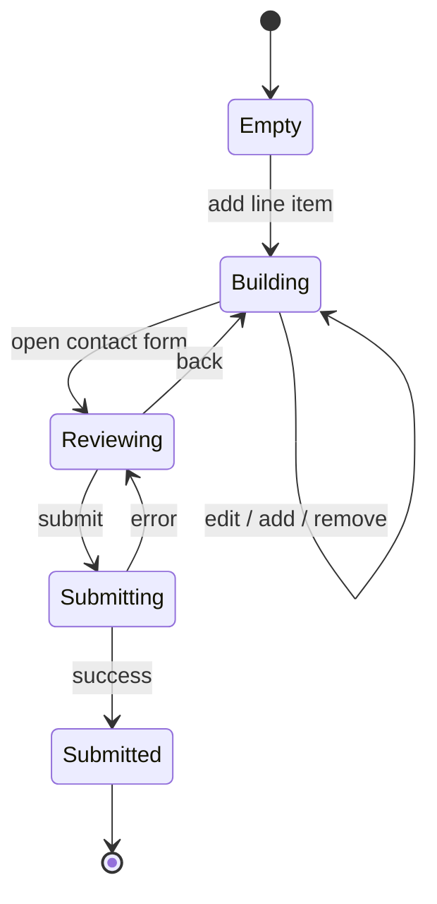

# Functional Spec

Feature-by-feature contract for the public site. Each feature lists what it does and how we know it works.

## Product catalog (`/products`)

- Renders all products from `src/data/products.ts`.
- Filters: chromatography type (IEC, affinity, SEC, HIC, magnetic), exchanger type (strong/weak cation/anion), flow variant (faster, standard, precise, hr), status (available, evaluation, pipeline).
- Filter state lives in URL search params so views are shareable.
- Empty state when filters return zero results, with a clear "reset" affordance.

**Acceptance:** All filter combinations render without errors; URL reflects state; back/forward preserves view.

## Product card

- Shows name, subtitle, status badge, key specs (matrix, particle size, DBC, max flow), tag chips.
- Actions: open detail modal, add to compare, add to RFQ.

**Acceptance:** Card actions never navigate away from `/products`.

## Product Detail Modal

- Full spec table, pack-size selector with catalog numbers, application chips, RFQ CTA.
- Closes via overlay click, escape, or close button; restores scroll and focus.

## Bead Size Selector

- Visualizes particle-size variants for a product family; clicking a variant updates the modal context.

## Filter Sidebar

- Sticky on desktop, sheet on mobile.
- Each section collapsible; counts shown beside each filter value.

## Find-Your-Resin Panel

- Two- to three-step guided question flow that narrows the catalog.
- Outputs a recommended product family with a "View matches" CTA into the filtered catalog.

## Compare bar / modal

- Bar appears when ≥ 1 product is selected; modal opens when ≥ 2.
- Side-by-side spec table; row highlighting for differences.
- Hard cap at 4 items; selecting a 5th replaces the oldest.

## RFQ drawer

- Holds line items (product + pack size + qty).
- Contact form: name, company, email, phone, country, message.
- Submit currently routes via mailto/WhatsApp; backend persistence is planned (see Database Reference).
- State persists across route changes via `RFQContext`.

**Acceptance:** Drawer state survives navigation; required fields validated; success state shown post-submit.

## RFQ state machine

## WhatsApp FAB

- Floating button, always visible, opens WhatsApp chat with prefilled greeting.
- Hidden on print.

## Documents hub (`/documents`)

- Password-gated via Edge Function (`verify-doc-password`).
- Lists docs in two sections: Public Spec, Internal Reference.
- Per-doc: read status (localStorage), markdown view, TOC, .md download, print.
- Bulk download zips all docs.

**Acceptance:** Wrong password shows error; correct password persists for the session; both routes are gated.

## SEO

- Per-page title and meta description.
- `public/sitemap.xml` and `public/robots.txt` deployed.
- Single H1 per page, semantic landmarks, alt text on images.