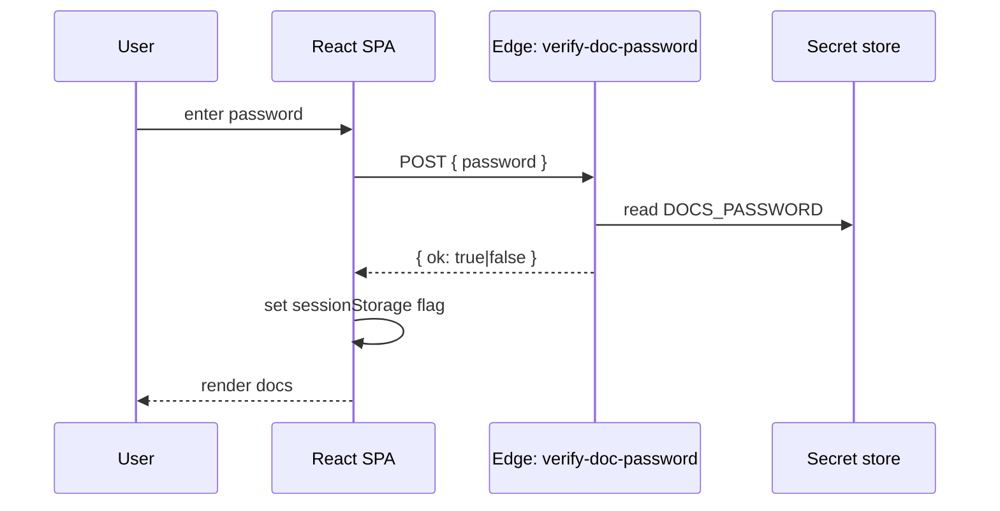

# Architecture & Tech

The system at a glance, the runtime stack, and how data and requests flow through it.

## Stack

| Layer | Choice |
|---|---|
| UI framework | React 18 |
| Build tool | Vite 5 |
| Language | TypeScript 5 |
| Styling | Tailwind CSS v3 + shadcn/ui |
| Routing | react-router v6 |
| Server state | TanStack Query |
| Backend | Lovable Cloud (managed Supabase) |
| Edge runtime | Deno-based Supabase Edge Functions |
| Markdown | react-markdown + remark-gfm + rehype-slug + rehype-autolink-headings |
| Diagrams | mermaid (lazy-loaded) |
| Hosting | Lovable platform with custom domain |

## System context

```mermaid
flowchart LR
  U[Visitor] -->|HTTPS| CDN[Lovable hosting / CDN]
  CDN --> SPA[React SPA]
  SPA -->|RFQ submit (planned)| EF1[Edge: rfq-submit]
  SPA -->|verify password| EF2[Edge: verify-doc-password]
  EF1 --> DB[(Lovable Cloud DB)]
  EF2 --> SEC[Secret: DOCS_PASSWORD]
  SPA -->|WhatsApp| WA[WhatsApp]
```

## Routing tree

```text
/                       Index → Home
/products
/applications
/about
/technology
/resources
/contact
/procurement            → redirect /about
/documents              gated
/documents/:slug        gated
/*                      NotFound
```

## Provider stack (top → bottom)

`QueryClientProvider` → `TooltipProvider` → `BrowserRouter` → `RFQProvider` → `CompareProvider` → `<Routes>`. The `DocAuthProvider` is mounted only inside the gated `/documents` routes so it doesn't leak global state.

## State boundaries

- **`RFQContext`** — current cart of line items + drawer open state.
- **`CompareContext`** — set of compared product ids.
- **`DocAuthContext`** — token-like flag in `sessionStorage` indicating verified access.
- **TanStack Query** — reserved for future server data; product catalog is currently static.

## Content pipeline

Markdown files under `src/content/docs/` are imported as raw strings via Vite's `?raw` query. The `_meta.ts` registry is the single source of truth for which docs exist, their order, public/internal grouping, and display metadata.

## Password verification flow



## Performance posture

- Static catalog ships in the bundle (small, ~30 SKUs).
- Mermaid loaded only when a code block requests it.
- Images served from `public/`; lazy attributes on non-critical imagery.
- Tailwind purged in production build.

## Security posture

- No raw secrets in client code.
- The docs gate is friction, not a vault — the markdown is bundled with the app, so treat it as semi-public.
- Future RFQ persistence will use RLS-protected tables behind authenticated Edge Functions.