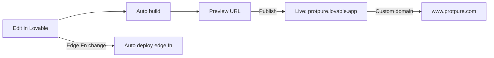

# Build & Operations

How the site is built, deployed, and kept healthy.

## Local development

- Install: `bun install`
- Run dev server: `bun run dev` (Vite, port auto-assigned)
- Type check + build: handled by the platform on every change
- Tests: `bunx vitest run`

## Environment variables

| Variable | Purpose | Where |
|---|---|---|
| `VITE_SUPABASE_URL` | Backend project URL | `.env` (auto-managed) |
| `VITE_SUPABASE_PUBLISHABLE_KEY` | Anon key for client SDK | `.env` (auto-managed) |
| `VITE_SUPABASE_PROJECT_ID` | Backend project ref | `.env` (auto-managed) |
| `DOCS_PASSWORD` | Server-side secret used by Edge Function | Lovable Cloud secret store |

The `.env` file is regenerated automatically. Never edit it by hand.

## Deploy pipeline

Every code change rebuilds the preview. Publishing promotes the preview to the live URL. Edge Function deploys are automatic on save.

## Custom domains

- `protpure.com` and `www.protpure.com` point to the published build.
- DNS managed by domain registrar; SSL handled by the platform.

## SEO setup

- `public/sitemap.xml` lists every public route. Update when adding pages.
- `public/robots.txt` references the sitemap and disallows `/documents`.
- Each page sets `<title>` and meta description.
- Single H1 per page; semantic landmarks (`<header>`, `<main>`, `<footer>`).

## Performance budget

| Asset class | Budget |
|---|---|
| Initial JS (gzipped) | < 250 KB |
| Initial CSS | < 30 KB |
| LCP image | < 200 KB |
| Time to interactive (mid-tier mobile) | < 3.5 s |

Mermaid is excluded from the initial bundle by lazy import; same approach should be applied to any future heavyweight library.

## Monitoring

- Console + network panels in the Lovable preview during development.
- Edge Function logs available via the platform.
- Lighthouse / SEO audits run on demand.

## Release checklist

1. Verify all routes render in preview.
2. Walk Journey A (browse → compare → RFQ).
3. Walk Journey B (find-your-resin → PDP → RFQ).
4. Confirm `/documents` gate accepts the current password.
5. Spot-check mobile layout at 375 px width.
6. Run a Lighthouse audit; fix any new errors.
7. Publish.
8. Smoke test the live URL on the custom domain.