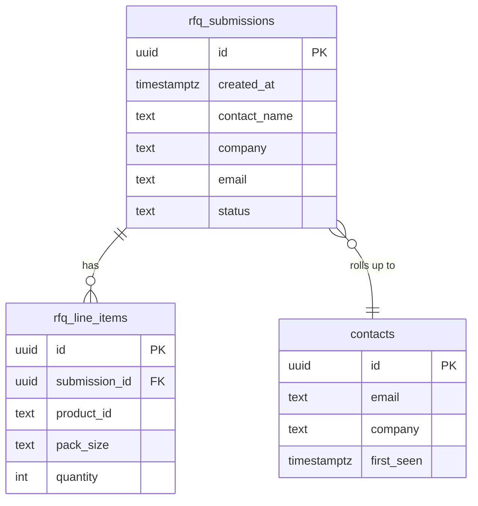

# Database Reference (Internal)

Current persistence footprint and the planned schema for when RFQ data lands in the database.

## Current state

- **No application tables.** The product catalog is static in `src/data/products.ts` and ships in the bundle.
- **No RFQ persistence yet.** Submissions currently route through email/WhatsApp.
- **Auth use is minimal.** The `/documents` gate verifies a single shared password via Edge Function. No user accounts.

## Why static-first

- Catalog churn is low (weeks, not minutes).
- Editing a typed `.ts` file gives type safety and atomic deploys.
- Avoids RLS, migrations, and admin UI work until volume justifies it.

Trigger to migrate to a DB-backed catalog: ≥ 50 SKUs, multiple non-engineer editors, or per-customer pricing.

## Planned tables (when RFQ persistence ships)

### `rfq_submissions`

| Column | Type | Notes |
|---|---|---|
| `id` | uuid PK | `gen_random_uuid()` |
| `created_at` | timestamptz | default `now()` |
| `contact_name` | text | required |
| `company` | text | required |
| `email` | text | required, validated |
| `phone` | text | optional |
| `country` | text | ISO-2 |
| `message` | text | optional |
| `status` | text | enum: new, qualified, quoted, won, lost |
| `source` | text | site, whatsapp, referral |

### `rfq_line_items`

| Column | Type | Notes |
|---|---|---|
| `id` | uuid PK | |
| `submission_id` | uuid FK → rfq_submissions | cascade delete |
| `product_id` | text | matches `products.ts` id |
| `pack_size` | text | catalog catNo |
| `quantity` | int | |

### `contacts` (CRM-lite)

Optional rollup table keyed by email; populated by a trigger on first submission and updated on subsequent ones.

## RLS posture

- All tables: RLS enabled.
- Inserts allowed only via the `rfq-submit` Edge Function (using a server role).
- Reads disallowed for the anon key.
- Internal admin reads gated by a future `user_roles` table with an `admin` role and a `has_role()` security-definer function.

## Planned ERD

## Migration discipline

- All schema changes via timestamped SQL migrations.
- Never use CHECK constraints with non-immutable expressions; use validation triggers.
- Never modify `auth`, `storage`, `realtime`, `supabase_functions`, or `vault` schemas.