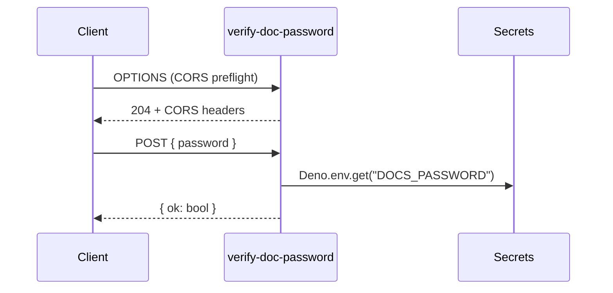

# Edge Functions Reference (Internal)

Inventory and contracts for server-side functions running on the Lovable Cloud edge runtime.

## Live functions

### `verify-doc-password`

- **Path:** `supabase/functions/verify-doc-password/index.ts`
- **Purpose:** Server-side check of the `/documents` shared password.
- **Method:** `POST`
- **Request:** `{ "password": string }`
- **Response:** `{ "ok": boolean }`
- **Secret used:** `DOCS_PASSWORD`
- **Auth:** `verify_jwt = false` — the call is anonymous by design.

**Why server-side.** Putting the password (or its hash) in client code would expose it to anyone who opens DevTools. Comparing on the edge keeps the secret out of the bundle and lets us rotate without a redeploy of the app.

**Failure modes**

| Cause | Response | Fix |
|---|---|---|
| Missing body | 400 | client validation |
| Wrong password | 200 with `ok: false` | user retries |
| Secret unset | 500 | set `DOCS_PASSWORD` in Cloud secrets |
| CORS preflight | 204 | already handled inline |

**Rate-limit recommendation.** Add a simple in-function counter keyed by IP (e.g., 10 attempts / 5 minutes) before exposing this function publicly to a wider audience. Not required for the current trusted-link use case.

### Invocation flow

## Planned functions

### `rfq-submit`

- Validate body, write `rfq_submissions` + `rfq_line_items`, fire a notification (email or WhatsApp), return `{ id }`.
- Uses service-role key inside the function; client never sees it.

### `lead-notify`

- Triggered on new `rfq_submissions` row (DB webhook).
- Sends a templated alert to the sales inbox.

## Conventions

- One function per directory under `supabase/functions/`.
- Inline CORS headers (avoid relying on resolver paths that don't work in Deno).
- Never import `npm:` packages without the `npm:` prefix; never use bare specifiers.
- All secrets via `Deno.env.get(...)`; never log secret values.
- Functions deploy automatically on save — no manual deploy step.

## Local invocation

During development, prefer testing through the SPA's `supabase.functions.invoke()` call rather than raw curl, so CORS and headers match production conditions.