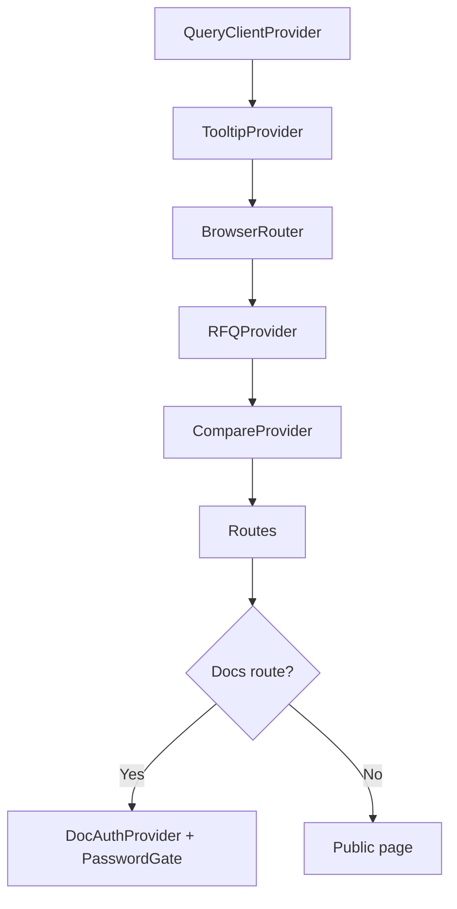

# Frontend Architecture (Internal)

How the React app is organized and the conventions that keep it maintainable as it grows.

## Folder layout

```text
src/
  components/
    layout/         Header, Footer, PageHero, WhatsAppFAB
    home/           Hero, USPGrid, ResinSelector, ...
    products/       Card, FilterSidebar, CompareBar, ...
    rfq/            RFQDrawer
    docs/           PasswordGate, MarkdownRenderer
    ui/             shadcn primitives — do not edit signatures
  context/          RFQ, Compare, DocAuth
  content/docs/     Markdown + _meta registry
  data/             Static catalog (products.ts)
  hooks/            Reusable hooks
  integrations/
    supabase/       client.ts + types.ts (auto-generated)
  lib/              utils
  pages/            One file per route
  test/             Vitest setup + examples
```

## Routing

All routes live in `src/App.tsx`. Public routes wrap `Index`/feature pages directly. The `/documents` and `/documents/:slug` routes are wrapped in `DocAuthProvider` + `PasswordGate` so the auth state is scoped to docs only.

## Provider tree



## Data flow

- **Static data** — imported directly from `src/data/products.ts`.
- **UI state** — local `useState` / `useReducer` inside the owning component.
- **Cross-route state** — Context (RFQ, Compare, DocAuth).
- **Server state (future)** — TanStack Query, never raw fetch.

## Code splitting

- Mermaid is loaded only when a markdown code block requests it (`await import("mermaid")`).
- Apply the same pattern to any future heavy library (charting, PDF, 3D).
- Route-level lazy loading is *not* in place today — the bundle is small enough that the trade-off isn't worth it. Revisit if initial JS exceeds the 250 KB budget.

## Naming conventions

- Components: `PascalCase`, one per file, named export and default export agree.
- Hooks: `useXxx`.
- Files inside `components/<domain>/` describe the domain feature, not the layout slot.
- Avoid `index.tsx` files in feature folders — explicit names make searches faster.

## Known gaps

- No global error boundary. Add one wrapping `<Routes>` before scaling up RFQ persistence.
- No analytics layer yet.
- No Storybook; component review happens in the live preview.

## Editing rules

- Never modify `src/integrations/supabase/client.ts` or `types.ts` (auto-generated).
- Never edit `.env`.
- Never write raw color values in components — use semantic Tailwind tokens.
- shadcn `ui/*` components are vendored — extend via composition, not by rewriting their props.