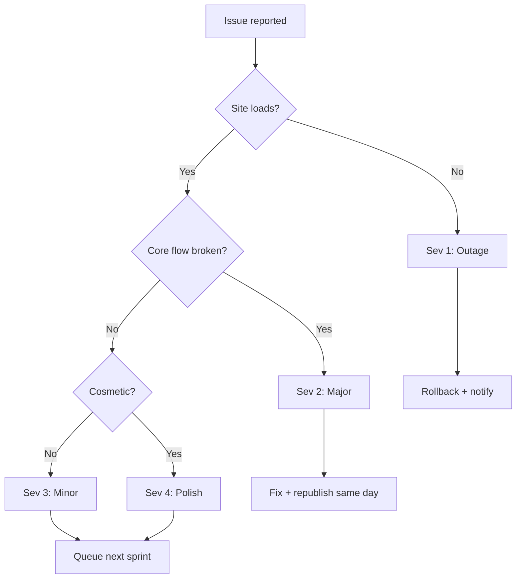

# Operations Runbook (Internal)

How to do the recurring tasks without breaking anything, and what to do when something does break.

## Common tasks

### Rotate the docs password

1. Update the `DOCS_PASSWORD` secret in the Lovable Cloud secret manager.
2. No app deploy required — the Edge Function reads the secret at invocation.
3. Notify anyone holding the old password through the same channel they originally received it.

### Add a product to the catalog

1. Edit `src/data/products.ts`.
2. Append a new entry; reuse `withPrefix(...)` for standard pack sizes.
3. Verify it renders on `/products` and that the relevant filters surface it.
4. If it introduces a new chromatography type, update the labels map and the filter sidebar.

### Add a new doc

1. Create the markdown file under `src/content/docs/NN-slug.md`.
2. Add a `?raw` import at the top of `src/content/docs/_meta.ts`.
3. Append an entry to the `DOCS` array (set `internal: true` if needed).
4. Map the slug in `SOURCES`.
5. Visit `/documents` and the new `/documents/<slug>` to confirm.

### Update the sitemap

1. Edit `public/sitemap.xml` — add a `<url>` block for each new public route.
2. Bump the `lastmod` dates for changed pages.
3. `public/robots.txt` already references the sitemap.

### Redeploy an Edge Function

- Save the function file. Deployment is automatic.
- Verify in the Edge Function logs that the new version is active.
- Smoke test by invoking from the SPA, not by curl, so CORS matches reality.

### Troubleshoot CORS errors on an Edge Function

1. Confirm the function returns the inline CORS headers on both `OPTIONS` and the real method.
2. Check the request origin matches what the function allows.
3. Avoid importing CORS helpers from `@supabase/supabase-js/cors` — Deno can't resolve it without an `npm:` prefix; inline the headers instead.

### Roll back a regression

1. Use the platform's version history to revert to the last good build.
2. Republish.
3. File an entry in the Decisions Log if the rollback reveals an architectural issue, not just a typo.

## Incident triage

| Severity | Definition | Response |
|---|---|---|
| Sev 1 | Site or `/documents` fully down | Rollback within 30 min |
| Sev 2 | Catalog, RFQ, or Compare broken | Fix same business day |
| Sev 3 | Single feature degraded, workaround exists | Next sprint |
| Sev 4 | Cosmetic / copy | Batched into next polish pass |

## On-call expectations

- Solo team reality: there is no rotation. Founders triage as issues are reported.
- Expectation: customer-reported Sev 1/2 acknowledged within 4 business hours.
- Internal monitoring is light; lean on customer reports and weekly Lighthouse runs.

## Recurring hygiene

- Weekly: Lighthouse audit on `/`, `/products`, one PDP modal flow.
- Monthly: review Edge Function logs for unexpected error patterns.
- Quarterly: rotate `DOCS_PASSWORD`; review Decisions Log; prune stale docs.